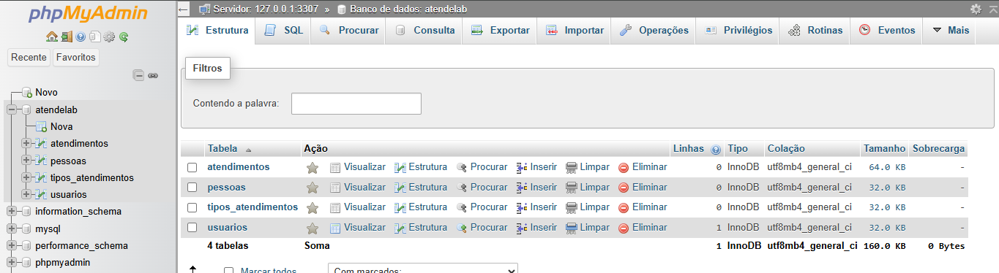
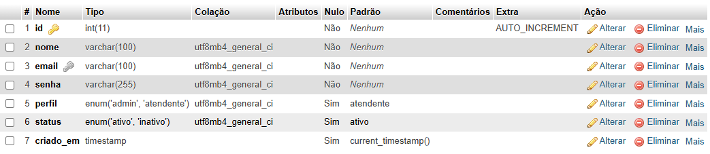
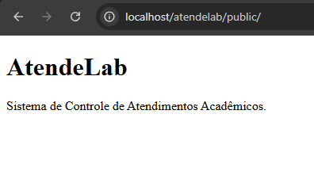
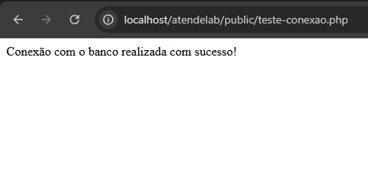

# AtendeLab
Sistema de Controle de Atendimentos Acadêmicos desenvolvido na disciplina de Fábrica de
Software.
## Tecnologias utilizadas
- PHP 8.x
- MySQL
- phpMyAdmin
- HTML
- CSS
- Bootstrap
- Git e GitHub
## Funcionalidades previstas
- Página pública
- Login
- Dashboard
- Cadastro de pessoas atendidas
- Cadastro de tipos de atendimento
- Registro de atendimentos
- Relatórios
## Como executar localmente
1. Clonar o repositório.
2. Colocar a pasta no htdocs do XAMPP.
3. Iniciar Apache e MySQL.
4. Criar o banco atendelab.
5. Importar o script database/atendelab.sql.
6. Acessar http://localhost/atendelab/public/

# Para o Professor:

## Print do phpMyAdmin

---
## Print da tabela ***usuarios***

---
## Print da página index funcionando

---
## Print do teste de conexão com banco de dados funcionando

